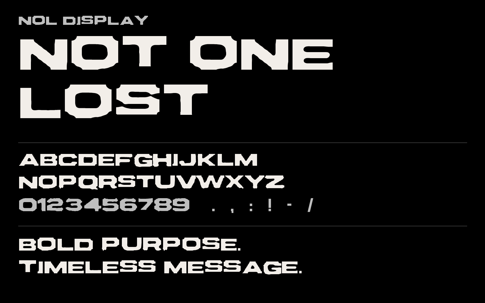

# NOL Display — your own brand font

A custom **uppercase display font** built for Not One Lost, traced directly from
the *Wide Bold / Extended* specimen on your brand sheet. This is your font — it
isn't a licensed third-party family.

## Files

| File | Use |
| --- | --- |
| `NOLDisplay-Regular.otf` | Desktop (design apps: Illustrator, Figma desktop, Photoshop). |
| `NOLDisplay-Regular.ttf` | Desktop (Windows/Mac/mobile), general use. |
| `NOLDisplay-Regular.woff2` | Web — smallest, modern browsers. |
| `NOLDisplay-Regular.woff` | Web — fallback for older browsers. |
| `font-face.css` | Ready-to-use `@font-face` rule for the web. |

## Install

- **Mac:** double-click the `.otf` (or `.ttf`) → *Install Font*.
- **Windows:** right-click the `.ttf` → *Install*.
- **Figma / Canva:** upload the `.ttf` (Figma needs the desktop font installer or a
  paid org font upload; Canva Pro → Brand Kit → Upload font).
- **Web:** copy `font-face.css` + the `.woff2/.woff/.ttf` and use
  `font-family: "NOL Display"`.

## Character set

`A–Z` · `0–9` · `. , : ! - / '` · space. Lowercase letters are mapped to the
capital shapes, so typing in either case gives you caps (the brand is all-caps).

## What it's for — and what it isn't

- ✅ Headlines, the wordmark, hero type, hats/tees/labels, big display copy.
- ⚠️ Not a body-text font. It's uppercase-only and drawn from a small specimen, so
  edges carry a slightly rugged, tactical texture (on-brand, but not for paragraphs).

## Roadmap / upgrades

- **Secondary (Condensed Regular):** the sheet's secondary specimen is too small and
  thin to trace cleanly, and body text needs crisp readability. Best path is to
  identify/license a condensed grotesque, or commission it. (Ask and I can help ID it.)
- **Full custom family:** if you later want lowercase, multiple weights, kerning, and
  extended punctuation/symbols, this display cut is a great reference to hand a type
  designer to build a complete family.
